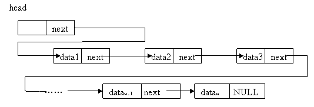

# 一、定义

## 1、线性表需求

线性表的基本需求有两点：

- 能够找到线性表的首元素(head)。
- 从线性表的任何一个元素开始，能够找到它之后的下一个元素(next)。

## 2、什么是链表(链接表)

基于链接技术实现的线性表称为链接表（简称 `链表`）。链接技术实现原理：

- 把表中的元素 `分别` 存储在  `独立的存储块`(称为链表的 `结点` )中。
- 在前一节点中 `显示` 的记录下一节点的地址。

## 3、顺序表 vs 链表

顺序表中的元素在内存中是连续存储的，关联的顺序是 `隐式`的；链表中的元素在内存中是分开存储的，关联的顺序是`显示`的。

# 二、链表分类
链表分为单链表，双链表。
# 三、单链表(single linked list)

## 1、定义

单向链表(简称 `单链表` 或者 `链表`)是链接方向为单向的链表。一个单链表的节点包含两个部分，第一个部分（元素域）存储关于节点的信息(如表示元素的数据项)，第二部分（链接域）存储下一个节点的地址。



([图来自维基百科](https://zh.wikipedia.org/wiki/%E5%8D%95%E5%90%91%E9%93%BE%E8%A1%A8))

- 表头变量(表头指针)

  用一个变量表示单链表的首结点的引用(如上图的head)，这样的变量称为表头变量或者表头指针。

- 单链表的结束

  为了表示一个链表的结束，最后一个节点的第二个部分需设置一个表示结束的值(在Python里，用None表示)，这个值称为 `空链接`。

## 2、节点的算法实现
一般地，自己实现某种数据结构的的时候，命名要注意避免与关键字雷同。

```
class LNode:
    def __init__(self, data, next_=None):
        """
        :param data: data
        :param next_: next element address
        """
        self.data = data
        self.next = next_
```

## 3、链表的基本操作

###  (1)创建一个空单链表

把表头变量的值设置为空链接(在Python中是None)。

### (2)删除链表

将表指针赋值为空(在Python中是None)。

### (3)判断表是否为空

将表头变量的值与空链接(在Python中是None)进行比较。

### (4)判断表是否已经满了

## 4、插入元素

插入元素可以分为表头插入，定位插入，表尾插入。和顺序表的不同的是，在单向链表中插入元素时，并不需要移动已有的元素，而是修改链接，接入新的节点。

### (1)表头插入
这是最简单的情况。只需要两步即可完成。

### (2)定位插入

### (3)表尾插入

### 