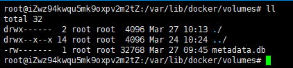
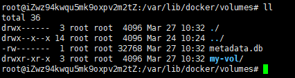

# 说明

- 命令的操作关注点有以下几方面：
  - 有哪些命令
  - 命令的语法
  - 执行命令后，命令做了什么
  - 命令是否有返回结果，如果有，返回的是什么

# 存储概述

docker提供了两种方式来实现将文件持久存储在宿主机中：卷(volume)和绑定挂载(bind mount)。


 # 卷（volumes）

docker把文件系的某个目录作为卷（在Linux系统中是`/var/lib/docker/volumes/`）。对于卷和绑定挂载卷，应该首选卷。因为绑定挂载依赖于宿主机的目录结构（如Linux系统目录结构是/root, /var,...，而windows系统目录结构是：c盘，d盘，...）。而卷是完全由Docker管理。

## 1、-v 和 --mount标志

本来，`-v` (或者`--volume`)用于独立的容器，而 `--mount`用于集群服务。但是从docker 17.06开始，  `--mount` 也可以用于独立的容器。那么我们应该选择哪个呢？推荐使用  `--mount` ,  因为 `-v` 标志把所有的可选项参数合并到一起，而`--mount`把这些可选项参数分开些，更明确。

## 2、创建和管理卷

### （1）create

创建一个名为my-vol的卷。

```
$ docker volume create my-vol
```

原来Linux文件系统目录结构：



创建了名为my-vol的卷后Linux文件系统目录结构：



### （2）list volumes

列出所有的卷。

```
$ docker volume ls
DRIVER              VOLUME NAME
local               my-vol
```

### （3）inspect a volume

`inspect`这个单词的本意是`to look at something or someone carefully` ——仔细查看某个东西。所以要查看某个卷的 `详细信息`，使用该命令。

```
$ docker volume inspect my-vol
[
    {
        "CreatedAt": "0001-01-01T00:00:00Z",
        "Driver": "local",
        "Labels": {},
        "Mountpoint": "/var/lib/docker/volumes/my-vol/_data",
        "Name": "my-vol",
        "Options": {},
        "Scope": "local"
    }
]

```

### （4）remove

```
# docker volume rm my-vol
my-vol
```

卷的全部命令及其用法使用`--help`查看。

## 3、创建一个带卷的容器

下面创建一个名为 `devtest` 的容器，如果启动容器的时候使用的是一个不存在的卷（如接下来示例的myvol2，之前并没有创建该卷），那么docker会自动创建该卷

```
$ docker run -d --name devtest --mount source=myvol2,target=/app nginx:latest
```

 说明：

- `--mount source=myvol2,target=/app`: 使用 `--mount` 标志把卷 `myvol2`挂载到容器的 `/app`目录。注意target和前面的逗号之间不能有空格。

# 绑定挂载（bind mounts）

# 实战：使用docker测试一个静态网站

# 参考资料

[1]docker文档, https://docs.docker.com/storage/

[2]James Turnbull, 《The Docker Book》:https://github.com/turnbullpress/dockerbook-code