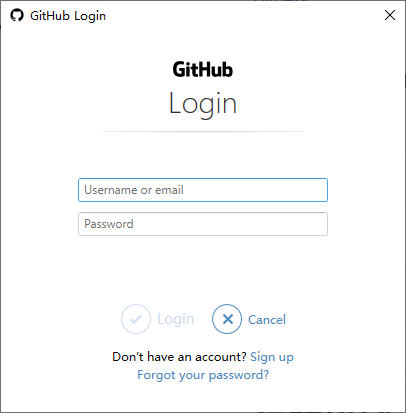
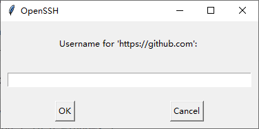
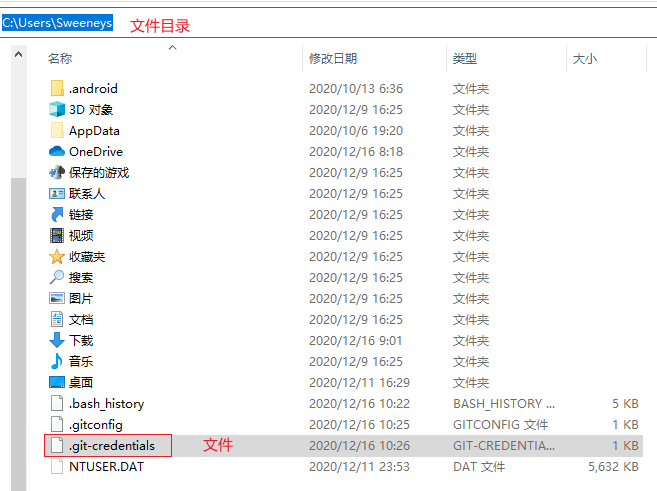

[TOC]

《git push 总是要登陆问题的解决办法》

# 背景描述

1、windows

```
>systeminfo
Windows 10 Pro
```

2、Git Bash:

```
$ git --version
git version 2.28.0.windows.1
```

# 问题描述

项目是通过 `git clone` 将github 上的项目拷贝到本地的（ `https` 的方式），但是每次使用 `git push` 将项目推送到github上的时候都提示要登陆，具体提示内容如下所示：

（1）提示GitHub Login



 

（2）提示OpenSSH



# 问题分析

1、这是 git 的一个认证问题，所以我们可以把认证信息存储下来，避免重复访问

# 解决方式

## 1、git config --global credential.helper store（不推荐）

进入到 git 项目中，然后运行命令 `git config --global credential.helper store` ，该命令会创建一个文件 `~/.git-credentials`（~符号表示用户目录），示例：



当然，也可以指定创建文件的目录，具体参考 [官方文档](https://git-scm.com/docs/git-credential-store) 。

因为 `.git-credentials` 存储的是明文密码，所以不推荐这种方式。

注：

（1）Logon failed, use ctrl+c to cancel basic credential prompt 错误

如果提示这个错误。可以使用下面的命令：


## 2、git credential


# 参考资料

[1] git-credential-store: https://git-scm.com/docs/git-credential-store

[2] git credential: https://git-scm.com/docs/gitcredentials

[3] git 工具，凭证存储： https://git-scm.com/book/zh/v2/Git-%E5%B7%A5%E5%85%B7-%E5%87%AD%E8%AF%81%E5%AD%98%E5%82%A8