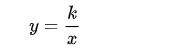

# 一、建议学习计划

## 1、学习进度：2章/天

## 2、优先级：1

# 二、书结构分析

总计10章，438页。

# 三、学习计划

- 按照“建议学习计划”执行。
  - 每天2章无法完成，改为一章。
- 将知识点绘制成思维导图。
- 答题用纸质文档书写。
- 记录学习时间，然后根据实际时间及时调整学习安排。

# 四、学习记录

## 1、学习时间及进度(20200327)

-  12:00-13:00  p1-p8
- 14:00-15:00 p9-p11
- 15:00-16:00 p12-p14
- 16:00-17:00 p15-p16
- 22:00-23:00 p17-

## 2、学习内容

### 1、整数（Integer）

（1）定义

整数是正整数，0， 负整数的统称。

（2）整数与四则运算

### 2、分数（Fraction）

（1）定义

分数由分子(numerator)和分母(denominator)组成。

（2）倒数(reciprocal)

将一个分数的分子和分母交换位置便得到该分数的倒数。

（3）最小公分母(LCD, the least common denominator)

 多个分数的分母的最小公倍数(LCM, the least common multiple)。

（4）分数与四则运算

### 3、运算符顺序（operations order）

（1）运算符的优先顺序

括号（parenthesis，从内到外）>指数运算（exponent）>乘除法（从左到右）>加减法（从左到右）。

（2）绝对值（absolute value）

绝对值表示数轴上一个数对应的点到原点的距离，用||(absolute value bar)表示。

### 4、代数性质（properties of algebra）

代数表达式化简(algebraic expression):

（1）用已知数代替未知数

将已知数带入的时候最好使用小括号括起来。

（2）合并同类项（like terms）

（3）分配律（contributive property）

$$
a \cdot (b \pm c) = a \cdot b + a \cdot c
$$
拓展：乘法运算定律——交换律，结合律，分配律。

## 3、遇到的问题及解决方法

## 4、学习总结

遇到翻译不通的地方，马上查，不能跳过。因为这有可能后面还会遇到，也有可能这是一个数学术语（如product）。

# 一、线性方程(linear equation)

## 遇到的问题及解决方法

1.jointly proportioanl正文翻译是啥？

## 学习内容

### 1、线性方程

（1）定义

即一次方程，因为在笛卡尔坐标系中，任何一个一次方程的表示都是一条直线。

（2）系数（coefficient）

有线性方程2x + 4y = 7, 那么称2是x的系数。

（3）绝对值方程

绝对值中含有未知数的方程称为绝对值方程。求解绝对值方程时需考虑结果为正负两种情况。如果等式两边都分别有且只有一个绝对值，那么最终只需要其中的一个绝对值考虑正负值情况即可。

（4）无解

如果任何值都不满足方程，那么则称该方程无解，用拉丁字母∅表示。

### 2、实数(real number)

 （1）定义

实数是有理数（rational）和无理数（irrational）的总称，用R(real)表示。

### 3、圆(circle)

（1）半径（radius）

用小写字母r表示。

（2）直径（diameter）

（3）周长（circumference）

（4）圆周率（ratio of the circumference to diameter）

用希腊字母Pi(π)表示。

### 4、比例（proportion）

（1）正比例（directly proportional）

若存在一非零常数k使：y=kx，则称变量y与变量x成比例（有时也称为成正比）。本质：y与x的比值总是常数k，一个变量随着另一个变量的递增而递增。（如圆的周长除以圆的直径的结果总是Pi。）

（2）反比例（ inversly proportional）

存在一非零常数k使:

则称变量y和变量x成反比。本质：y与x的乘积总是常数k。一个变量随着另一个变量的递增而递减。

（3）jointly proportional

### 5、平方(square) & 平方根(square root)

### 6、数与集合

（1）周长（perimeter）

（2）三角形（triangle）

三角形三个内角（angel）度数（degree/measure）之和为180度。

（3）矩形（rectangle）

矩形周长计算公式: P=2(L+W)

## 作业情况统计

（1）结果

总计：407道， 错误：31道，正确：376，正确率：92%

（2）分析

错误原因主要为计算错误，其它为审题错误。

## 学习总结

1、黑体加粗的文字是强调内容。

2、当在做某个动作的时候，会让我们想起之前做这个动作的时候，此时要防止注意力转移。

3、 必要时，把计算步骤细化，防止计算错误。

# 错误汇总

## 1、p74

内容“The sum of their ages will be 29”，29应该是28。

## 2、p84

内容“ startegy”应该是strategy。