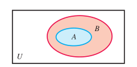

# R1、集合(set)

## 1、定义

一个或多个对象构成的整体称为集合。集合用大括号**{}**表示, 用**大写字母**命名。

```
S={1, 2, 3, 46}
```

## 2、特性

### （1）无序性

## 3、元素

集合中的对象称为**元素(element)**或者**成员(member)**。如果一个元素属于一个集合，写作：

```
4∈{1,2,3,4}
```

反之，写作：

```
5∉ {1,2,3,4}
```

## 4、分类

### (1)无穷集（infinite set）

### (2)有限集(finite set)

### (3)自然数集

N = {1, 2, 3,...}

注释：在我国的规定中，自然数包括0，即非负整数（可以分为偶数、奇数，或者分为合数、质数）。

## 5、表示方法

### (1)列举法

S = {1,2,3,4}

### (2)描述法

set-builder notation。

{x|x是2到7之间的自然数}

### (3)图像法(Venn diagram)

韦恩图。



### (4)符号法

如自然数集: N。

## 6、集合运算(set operation)

### (1)全集(universal set)

使用符号${\mathbb U}$表示。

### (2)空集(null set/empty set)

使用符号${ \varnothing }$表示。

### (3)子集(subset)

​	如果一个集合S中的所有元素都是属于另一个集合N。则称S是N的子集，用符号⊆表示。写作：$S{\subseteq}N$。

如果一个集合不是另一个集合的子集，则用符号${\nsubseteq}$表示。写作：S${\nsubseteq}$N 。

​	 任何集合都是它本身的子集，空集是任何集合的子集。

### (4)补集(complement)

给定集合A，全集U且A${\subseteq}$U。由所有属于U但是不属于A的元素组成的集合称为A的**补集**。写作：A' = {x|x ${\in}$U, x ${ \notin }$ A}。

特别地，U 和 ${ \varnothing }$ 互为补集。

### (4)交集(intersection)

给定集合A，B，由所有属于A且属于B的元素组成的集合称为A与B的**交集**。写作：A ${\cap}$ B  = {x | x ${\in}$A且x ${\in}$ B}

### (5)不相交集(disjoint set)

如果两个集合的交集为 ${ \varnothing}$ ，则这两个集合互为不相交集。

### (6)并集

给定集合 A，集合 B，由所有属于 A 或者属于 B 的元素组成的集合称为 A 与 B 的**并集**。写作：A${ \cup }$B = {x|x ${ \in }$ A或x ${ \in }$ B} 。

# R2.实数及其性质

## 1、数集及数轴

### (1)自然数(natural numbers)

{1,2,3, ...}

### (2)非负整数(whole numbers)

由1和所有的自然组成的集合称为非负整数集合。{0,1,2,3,...}。

### (3)整数(Intergers)

由所有的负整数，0， 正整数组成的集合称为整数集合。{..., -2, -1, 0, 1, 2, ...}。

- 假分数也算整数。

### (4)有理数(rational numbers)&无理数(irational numbers)

整数和分数的统称。用集合表示为：$\{{\frac{p}{q}}| p和q是整数，且q{\neq}0 \}$。

无理数：无限不循环小数，如：${\sqrt{5}}$

### (5)实数(real numbers)

有理数和无理数的总称，对应数轴上所有的数。

## 2、指数

### (1)代数式(algebra expression)

用基本的运算符号(加，减，乘，除，乘方，开方)把数**或**者代表数的字母连起来的表达式称为**代数式**。如：-2x$^{2}$ + 3x。

- 单独的一个字母或数字也是代数式。
- 如果是分数，必须化简；数值大于1，必须写成假分数。

### (2)指数(exponential)

n个a相乘，我们可以写作a$^{n}$的形式，其中a称为底数(base)，n称为指数(exponent)。

## 3、操作符顺序

## 4、实数性质

设a，b，c是任意的实数。

### (1)封闭性(closure properties)

a+b，ab也是实数。

拓展：任意两个实数的和、差、商(分母不为零)、积都是实数。

### (2) 交换律(commutative properties)

加法交换律：

a+b = b+a

乘法交换律：

ab = ba

### (3)结合率(associative properties)

加法：

(a + b) + c = a + (b + c)

乘法：

(ab)c = a(bc)

### (4)恒等性(identity properties)

加法：任何数和0相加等于该数本身。

```
a + 0 = a and 0 + a = a
```

乘法：任何数乘以1等于该数本身。

```
a * 1 = a and 1 * a = a
```

### (5)相反性(inverse properties)

加法：两个相反数相加等于0。

```
a + (-a) = 0
```

乘法：两个互为倒数的数相乘，乘积为1。

a * ${\frac{1}{a}}$ = 1

### (6)分配律(distributive properties)

a(b + c) = ab + ac
a(b - c) = ab - ac

### (7)零的乘法性质(multiplication property of zero)

0乘以任何书等于0。

0 * a = a * 0=0

## 5、数轴顺序(order on the number line)

在数轴上，如实数 a 在实数 b 的左边，我们就说 a 小于 b，写作： a < b。

反之，则说 a  大于 b， 写作：a > b

### (1)不等式(inequality)

示例：a < b < c

## 6、绝对值(absolute value)

数轴上一个数到0的距离称为该数的**绝对值**。

### (1)绝对值的性质
1.  |a|${ \ge }$ 0
2.  |-a| = |a|
3.  |a| * |b| = |ab|
4.  ${\frac{ |a|}{|b|}}$ = |${ \frac{a}{b}}$| (b${\ne}$0)
5.  |a + b| ${ \leq }$  |a| +  |b|

# R3、多项式(polynomial)

## 一、指数运算法则(Rules of Exponents)

## 1、乘法法则(Product Rule)

a^m^ . a^n^ = a^m+n^

## 2、幂的指数

(a^m^)^n^ = a^mn^

## 3、积的指数

(ab)^M^ = a^m^b^m^

## 4、商的指数

(${ \frac{a}{b}}$)^m^ = ${\frac{a^{m}}{b^{n}}}$ (b ${ \ne}$ 0)

## 5、0指数

对于任意的非0实数a，有a^0^ = 1。

## 二、多项式(Polynomials)

## 1、单项式(monomial)

由数字或字母的**乘积**组成的代数式称为单项式。单项式中数字因式称为这个单项式的系数(coefficient)。

注释：

(1)单独的一个数或者字母也是单项式。

(2)必须是乘积，不能是除。

## 2、同类项(like terms)

如果两个单项式，它们所含的字母相同，并且相同字母的指数也相同，那么就称者两个单项式为同类项。

## 3、多项式(Polymonial)

若干个单项式相加组成的代数式称为多项式。包含两项的称为二项式 (binomial)，包含三项的称为三项式(trinomial)。

注：

(1)多项式应该根据单项式的次数从高到低写。

## 4、次数(degree of a term)

### (1)单项式

单项式所有字母的次数的和称为该单项式的**次数**。示例： x ^6^y^2^ 的次数为：6+2=8

### (2)多项式

在多项式中，次数最高的单项式的次数称为该多项式的次数。示例：2x ^4^ y ^3^ - 3x^5^y +x ^6^y^2^的次数为8。

## 三、多项式加减(Addition and Subtraction)

同类项的系数相加减。

## 四、多项式相乘(Multiplication)

### (1)法一：水平相乘。

特别地，对于二项式，可以概括为FOIL。

### (2)法二：垂直相乘

### (3)平方差公式(difference of squares)

x^2^ - y ^2^ = (x + y)(x - y)

### (4)完全平方三项式(perfect square trinomials)

完全平方和：(x + y)^2^ = x^2^  + 2xy  + y ^2^

完全平方差：(x - y)^2^ = x^2^   - 2xy + + y ^2^

## 五、多项式相除(Division)

### (1)长除法(long division)

对于未知数，长除法要求未知数的次数从高到低，必须每项都出现，如果没有的用0乘以该项不全。

# R4、多项式分解(factoring Polynomials)

## 一、提取最大公因式(Factoring Out the Greatest Common Factor)

### 1、因式分解(factoring)

把一个多项式分解为几个整式相乘的形式，称为因式分解。如：4x + 12 = 4(x + 3)，其中4称为因子(factor)。

注：

(1)因式分解是乘法(multiplication)的反向操作。

### 2、素多项式(prime polynomial)

不能进行因式分解的多项式称为素多项式。

注：

(1)因式分解到不能再分解，那么这样的因式分解称为完全因式分解(complete factorization)。

## 二、分组分解(Factoring by Grouping)

用于三项以上的多项式。

## 三、分解三项式(Factoring Trinomials)

使用FOIL方法。特别地，要注意完全平方公式。

## 四、分解二项式(Factoring Binomials)

### (1)平方差公式(difference of Square)

x^2^ - y^2^ = (x + y) (x - y)

### (2)立方差公式(difference of Cubes)

x^3^ - y^3^ = (x - y) (x^2^ + xy + y^2^)

### (3)立方和公式(sum of Cubes)

x^3^ - y^3^ = (x + y) (x^2^ - xy + y^2^)

## 五、替代法分解(Factoring by Substitution)

用单项式代替多项式进行因式分解，然后再替换回去。

注：无论使用什么方法分解，先提取GCF。

# R5、有理式(Rational Expression)

## 一、有理式(Rational Expression)

两个多项式相除得到的商称为有理式，包括分式和整式。记作：${\frac{p}{q}}(q  { \ne0})$。示例：${\frac{x + 6}{x + 2}}$。

注：

(1)有理式的域是全体实数。

## 二、最简式(Lowest Terms of a Rational Expression)

如果有理式的最大公因子是1，那么这样的有理式称为有理式的最简式。

## 三、乘除法(multiplication&Division)

乘法：两个有理式相乘，分子(numerator)、分母(denominator)分别相乘。

除法：除以一个有理式，等于乘以一个有理式的倒数。

${\frac{a}{b}}*{\frac{c}{d}}={\frac{ac}{bd}}$

${\frac{a}{b}}{\div}{\frac{c}{d}}={\frac{a}{b}}*{\frac{d}{c}}$

注：

(1)被除数(dividend, the first number)，除数(divisor, the second number)。

## 四、加减法(Addition&Subtraction)

分母先通分，然后分子相加减。

注：

(1)LCD: the Least Common Denominator,最小公分母。

## 五、繁分数(Complex Fraction)

分子(或分母)含有四则运算(或分数)的数称为**繁分数**。示例：${\frac{6 - {\frac{6}{k}} }{1 + \frac{5}{k}}}$

# R6、有理指数(Rational Exponents)

## 一、负指数幂和除法法则(Negative Exponents and the Quotient Rule)

### 1、负指数幂

正数(nonzero real number)a的负指数幂等于a的正指数幂的倒数。记作：a^n^ = ${\frac{1}{a^{n}}}$(n${\in}$ R且n>0)。

注：

(1)(${\frac{a}{b}}$)^-n^ = (${\frac{b}{a}}$)^n^

### 2、除法法则

同底数幂相除，底数不变，指数相减。记作：${\frac{a^{m}}{b^{n}}}$= a^m-n^(n${\in}$ R且n>0且m,n${\in}Z$)

注：

(1)先按乘法法则，幂法则，除法法则计算，最后再求倒数。

## 二、有理数指数幂(Rational Exponents)

### 1、分数指数

有理指数分数指数，是根式的一种表达形式。记作：a^m/n^ = (a^1/n^)^m^

## 三、再看繁分数(Complex Fractions Revisited)

# R7、根式(Radical Expressions)

## 一、根号(Radical Notation)

### 1.根号

根式用${\sqrt[n]{a}}$表示，其中${\sqrt {\color {white}x}}$称为根号(radical symbol)，n称为指数(index)，a称为被开方数(radicand)。根式与有理式的关系记作：$a^{\frac{m}{n}}$ = (${\sqrt[n]{a}}$)^m^=${\sqrt[n]{a^{m}}}$(a${\in}R$, m${\in}Z$, n${\in}N$)。

注：

(1)如果指数是2，可以省略。

(2)偶次根号下的结果不能为负数，奇次根号下的结果为负数。

### 2、方根运算法则

(1)乘法法则

积的根是根的积。

${\sqrt[n]{ab}}={\sqrt[n]{a}}$.${\sqrt[n]{b}}$

(2)除法法则

商的根是根的商。

${\sqrt[n]{\frac{a}{b}}}={\frac{{\sqrt[n]{a}}}{{\sqrt[n]{b}}}}$

(3)乘方法则

指数的乘积等于连续开方。

${\sqrt[mn]{a}}={\sqrt[m]{{\sqrt[n]{a}}}}$ 

## 二、根式化简(Simplified RADICALS)

### 1、最简根式

(1)被开方数不能再开方。

(2)被开方数不是分数。

(3)分母不包含被开方数。

(4)同类项已被合并。

## 三、根式运算(Operations with Radicals)

### 1、加减法

前提条件：被开方数相同且根式指数相同。

## 四、分母有理化(Rationalizing Denominators)

### 1、共轭(conjugate)

# 1.1线性方程

## 一、方程的基本术语

Basic Terminology of Equation.

### 1、方程

含有未知数的等式称为方程(equation)。

### 2、解/根

使方程成立的未知数的值称为方程的"解(solution)"或者"根(root)" 。所有的解组成的集合称为方程的解集(solution set)。

### 3、同解方程

如果两个方程的解相同，那么这两个方程称为同解方程(也叫“等价方程”、“等值方程”，equivalent equations)

### 4、等式性质

可以使用等式的性质解方程。

(1)加法性质

等式两边同时加上(或减去)同一个等式，等式仍然成立。

(2)乘法性质

等式两边同时乘以(或除以)一个不为零的等式，等式仍然成立。

注：

(1)解方程时记得要验证(check)结果。

## 二、线性方程

### 1、线性方程

未知数(variable)的次数(degree)是一次的方程称为线性方程(Linear Equations)。线性方程也称为一次方程(first-degree equation)。

注：

(1)${\frac{1}{x}}$ = -8不是线性方程，因为x的次数是-1。

### 2、一元一次方程

只含有一个未知数，且未知数的次数是一次的方程(也叫一元线性方程)。记作：ax + b = 0( $a{\neq}0,a,b{\in}R$ 0)。如果含有两个未知数，且未知数的次数是一次，那么就说二元一次方程。

## 三、恒等/条件/矛盾方程

### 1、恒等方程

方程的解是任何值的方程称为恒等方程(identity)。

### 2、条件方程

方程的解为某些值的方程称为条件方程(conditional equation)。

### 3、矛盾方程

无解的方程称为矛盾方程(contradiction)。

## 四、求解指定的未知数(文字方程)

Solving for a specified Variable(Literal Equations).

### 1、文字方程

不含数字的方程称为文字方程(literal equation)。

### 2、单利(simple interest)

只有本金计算利息，往期利息不纳入下一个周期利息计算的计息方式。

(1)利息计算公式：I=Prt(P:本金，r:利率，t:计息时间，通常以年为单位)

(2)到期值(maturity value):本金+利息 ，A=P(1+rt)

# 1.2、线性方程的应用

Application and Modeling with Linear Equation.

## 一、解应用题

solving applied problem.

## 二、几何问题

geometry problem.

### 1、周长(perimeter)

### 2、面积(area)

### 3、图形中英文名称

(1)cylinder: 圆柱体

(2)triangle: 三角形

(3)rectangle: 矩形。
(4)

## 三、运动问题

motion problem.

### 1、距离(distance)

### 2、速率(rate)

一般表示为speed，物理上用velocity表示。

### 3、时间(time)

d = rt。

### 4、比赛中英文名称

(1)World Track and Field Championship: 世界田径锦标赛


## 四、混合物问题

mixture problem.

### 1、升(liter)

1 gallon = 4.5 liter.

1 liter = 1000 milliliter(毫升) 

### 2、换气次数(ach)

air change per hour.

又叫换气率(air change rate),指单位时间内空气更换的次数，

换气系数计算式为：

$N={\frac{Q}{V}}$

其中：

- *N* = 换气次数（h^-1^)
- *Q* = 每小时进入房间的风量 (m3/h)
- V = 房间体检= *长*x *宽* × *高* (m3)

## 五、建模

modeling with linear equations.

# 常见单位换算

## 1、英里(mile)

1 mile = 1.60934 km(公里) = 1609.34 m（米）

1 mile = 

# 参考资料

[1]List of Latex mathematical symbol: https://oeis.org/wiki/List_of_LaTeX_mathematical_symbols#Set_and.2For_logic_notation

[2]lsu, College Algebra and Trigonometry: https://www.math.lsu.edu/dept/courses/videos


