# R1、集合(set)

## 1、定义

一个或多个对象构成的整体称为集合。集合用大括号**{}**表示, 用**大写字母**命名。

```
S={1, 2, 3, 46}
```

## 2、特性

### （1）无序性

## 3、元素

集合中的对象称为**元素(element)**或者**成员(member)**。如果一个元素属于一个集合，写作：

```
4∈{1,2,3,4}
```

反之，写作：

```
5∉ {1,2,3,4}
```

## 4、分类

### (1)无穷集（infinite set）

### (2)有限集(finite set)

### (3)自然数集

N = {1, 2, 3,...}

注释：在我国的规定中，自然数包括0，即非负整数（可以分为偶数、奇数，或者分为合数、质数）。

## 5、表示方法

### (1)列举法

S = {1,2,3,4}

### (2)描述法

set-builder notation。

{x|x是2到7之间的自然数}

### (3)图像法(Venn diagram)

韦恩图。


### (4)符号法

如自然数集: N。

## 6、集合运算(set operation)

### (1)全集(universal set)

使用符号${\mathbb U}$表示。

### (2)空集(null set/empty set)

使用符号${ \varnothing }$表示。

### (3)子集(subset)

​	如果一个集合S中的所有元素都是属于另一个集合N。则称S是N的子集，用符号⊆表示。写作：$S{\subseteq}N$。

如果一个集合不是另一个集合的子集，则用符号${\nsubseteq}$表示。写作：S${\nsubseteq}$N 。

​	 任何集合都是它本身的子集，空集是任何集合的子集。

### (4)补集(complement)

给定集合A，全集U且A${\subseteq}$U。由所有属于U但是不属于A的元素组成的集合称为A的**补集**。写作：A' = {x|x ${\in}$U, x ${ \notin }$ A}。

特别地，U 和 ${ \varnothing }$ 互为补集。

### (4)交集(intersection)

给定集合A，B，由所有属于A且属于B的元素组成的集合称为A与B的**交集**。写作：A ${\cap}$ B  = {x | x ${\in}$A且x ${\in}$ B}

### (5)不相交集(disjoint set)

如果两个集合的交集为 ${ \varnothing}$ ，则这两个集合互为不相交集。

### (6)并集

给定集合 A，集合 B，由所有属于 A 或者属于 B 的元素组成的集合称为 A 与 B 的**并集**。写作：A${ \cup }$B = {x|x ${ \in }$ A或x ${ \in }$ B} 。

# R2.实数及其性质

## 1、数集及数轴

### (1)自然数(natural numbers)

{1,2,3, ...}

### (2)非负整数(whole numbers)

由1和所有的自然组成的集合称为非负整数集合。{0,1,2,3,...}。

### (3)整数(Integer)

由所有的负整数，0， 正整数组成的集合称为整数集合。{..., -2, -1, 0, 1, 2, ...}。

- 假分数也算整数。

### (4)有理数(rational numbers)&无理数(irational numbers)

整数和分数的统称。用集合表示为：$\{{\frac{p}{q}}| p和q是整数，且q{\neq}0 \}$。

无理数：无限不循环小数，如：${\sqrt{5}}$

### (5)实数(real numbers)

有理数和无理数的总称，对应数轴上所有的数。

## 2、指数

### (1)代数式(algebra expression)

用基本的运算符号(加，减，乘，除，乘方，开方)把数**或**者代表数的字母连起来的表达式称为**代数式**。如：-2x$^{2}$ + 3x。

- 单独的一个字母或数字也是代数式。
- 如果是分数，必须化简；数值大于1，必须写成假分数。

### (2)指数(exponential)

n个a相乘，我们可以写作a$^{n}$的形式，其中a称为底数(base)，n称为指数(exponent)。

## 3、操作符顺序

## 4、实数性质

设a，b，c是任意的实数。

### (1)封闭性(closure properties)

a+b，ab也是实数。

拓展：任意两个实数的和、差、商(分母不为零)、积都是实数。

### (2) 交换律(commutative properties)

加法交换律：

a+b = b+a

乘法交换律：

ab = ba

### (3)结合率(associative properties)

加法：

(a + b) + c = a + (b + c)

乘法：

(ab)c = a(bc)

### (4)恒等性(identity properties)

加法：任何数和0相加等于该数本身。

```
a + 0 = a and 0 + a = a
```

乘法：任何数乘以1等于该数本身。

```
a * 1 = a and 1 * a = a
```

### (5)相反性(inverse properties)

加法：两个相反数相加等于0。

```
a + (-a) = 0
```

乘法：两个互为倒数的数相乘，乘积为1。

a * ${\frac{1}{a}}$ = 1

### (6)分配律(distributive properties)

a(b + c) = ab + ac
a(b - c) = ab - ac

### (7)零的乘法性质(multiplication property of zero)

0乘以任何书等于0。

0 * a = a * 0=0

## 5、数轴顺序(order on the number line)

在数轴上，如实数 a 在实数 b 的左边，我们就说 a 小于 b，写作： a < b。

反之，则说 a  大于 b， 写作：a > b

### (1)不等式(inequality)

示例：a < b < c

## 6、绝对值(absolute value)

数轴上一个数到0的距离称为该数的**绝对值**。

### (1)绝对值的性质
1.  |a|${ \ge }$ 0
2.  |-a| = |a|
3.  |a| * |b| = |ab|
4.  ${\frac{ |a|}{|b|}}$ = |${ \frac{a}{b}}$| (b${\ne}$0)
5.  |a + b| ${ \leq }$  |a| +  |b|

# R3、多项式(polynomial)

## 一、指数运算法则(Rules of Exponents)

## 1、乘法法则(Product Rule)

a^m^ . a^n^ = a^m+n^

## 2、幂的指数

(a^m^)^n^ = a^mn^

## 3、积的指数

(ab)^M^ = a^m^b^m^

## 4、商的指数

(${ \frac{a}{b}}$)^m^ = ${\frac{a^{m}}{b^{n}}}$ (b ${ \ne}$ 0)

## 5、0指数

对于任意的非0实数a，有a^0^ = 1。

## 二、多项式(Polynomials)

## 1、单项式(monomial)

由数字或字母的**乘积**组成的代数式称为单项式。单项式中数字因式称为这个单项式的系数(coefficient)。

注释：

(1)单独的一个数或者字母也是单项式。

(2)必须是乘积，不能是除。

## 2、同类项(like terms)

如果两个单项式，它们所含的字母相同，并且相同字母的指数也相同，那么就称者两个单项式为同类项。

## 3、多项式(Polymonial)

若干个单项式相加组成的代数式称为多项式。包含两项的称为二项式 (binomial)，包含三项的称为三项式(trinomial)。

注：

(1)多项式应该根据单项式的次数从高到低写。

## 4、次数(degree of a term)

### (1)单项式

单项式所有字母的次数的和称为该单项式的**次数**。示例： x ^6^y^2^ 的次数为：6+2=8

### (2)多项式

在多项式中，次数最高的单项式的次数称为该多项式的次数。示例：2x ^4^ y ^3^ - 3x^5^y +x ^6^y^2^的次数为8。

## 三、多项式加减(Addition and Subtraction)

同类项的系数相加减。

## 四、多项式相乘(Multiplication)

### (1)法一：水平相乘。

特别地，对于二项式，可以概括为FOIL。

### (2)法二：垂直相乘

### (3)平方差公式(difference of squares)

x^2^ - y ^2^ = (x + y)(x - y)

### (4)完全平方三项式(perfect square trinomials)

完全平方和：(x + y)^2^ = x^2^  + 2xy  + y ^2^

完全平方差：(x - y)^2^ = x^2^   - 2xy + + y ^2^

## 五、多项式相除(Division)

### (1)长除法(long division)

对于未知数，长除法要求未知数的次数从高到低，必须每项都出现，如果没有的用0乘以该项补全。

# R4、多项式分解(factoring Polynomials)

## 一、提取最大公因式(Factoring Out the Greatest Common Factor)

### 1、因式分解(factoring)

把一个多项式分解为几个整式相乘的形式，称为因式分解。如：4x + 12 = 4(x + 3)，其中4称为因子(factor)。

注：

(1)因式分解是乘法(multiplication)的反向操作。

### 2、素多项式(prime polynomial)

不能进行因式分解的多项式称为素多项式。

注：

(1)因式分解到不能再分解，那么这样的因式分解称为完全因式分解(complete factorization)。

## 二、分组分解(Factoring by Grouping)

用于三项以上的多项式。

## 三、分解三项式(Factoring Trinomials)

使用FOIL方法。特别地，要注意完全平方公式。

## 四、分解二项式(Factoring Binomials)

### (1)平方差公式(difference of Square)

x^2^ - y^2^ = (x + y) (x - y)

### (2)立方差公式(difference of Cubes)

x^3^ - y^3^ = (x - y) (x^2^ + xy + y^2^)

### (3)立方和公式(sum of Cubes)

x^3^ - y^3^ = (x + y) (x^2^ - xy + y^2^)

## 五、替代法分解(Factoring by Substitution)

用单项式代替多项式进行因式分解，然后再替换回去。

注：无论使用什么方法分解，先提取GCF。

# R5、有理式(Rational Expression)

## 一、有理式(Rational Expression)

两个多项式相除得到的商称为有理式，包括分式和整式。记作：${\frac{p}{q}}(q  { \ne0})$。示例：${\frac{x + 6}{x + 2}}$。

注：

(1)有理式的域是全体实数。

## 二、最简式(Lowest Terms of a Rational Expression)

如果有理式的最大公因子是1，那么这样的有理式称为有理式的最简式。

## 三、乘除法(multiplication&Division)

乘法：两个有理式相乘，分子(numerator)、分母(denominator)分别相乘。

除法：除以一个有理式，等于乘以一个有理式的倒数。

${\frac{a}{b}}*{\frac{c}{d}}={\frac{ac}{bd}}$

${\frac{a}{b}}{\div}{\frac{c}{d}}={\frac{a}{b}}*{\frac{d}{c}}$

注：

(1)被除数(dividend, the first number)，除数(divisor, the second number)。

## 四、加减法(Addition&Subtraction)

分母先通分，然后分子相加减。

注：

(1)LCD: the Least Common Denominator,最小公分母。

## 五、繁分数(Complex Fraction)

分子(或分母)含有四则运算(或分数)的数称为**繁分数**。示例：${\frac{6 - {\frac{6}{k}} }{1 + \frac{5}{k}}}$

# R6、有理指数(Rational Exponents)

## 一、负指数幂和除法法则(Negative Exponents and the Quotient Rule)

### 1、负指数幂

正数(nonzero real number)a的负指数幂等于a的正指数幂的倒数。记作：a^n^ = ${\frac{1}{a^{n}}}$(n${\in}$ R且n>0)。

注：

(1)(${\frac{a}{b}}$)^-n^ = (${\frac{b}{a}}$)^n^

### 2、除法法则

同底数幂相除，底数不变，指数相减。记作：${\frac{a^{m}}{b^{n}}}$= a^m-n^(n${\in}$ R且n>0且m,n${\in}Z$)

注：

(1)先按乘法法则，幂法则，除法法则计算，最后再求倒数。

## 二、有理数指数幂(Rational Exponents)

### 1、分数指数

有理指数分数指数，是根式的一种表达形式。记作：a^m/n^ = (a^1/n^)^m^

## 三、再看繁分数(Complex Fractions Revisited)

# R7、根式(Radical Expressions)

## 一、根号(Radical Notation)

### 1.根号

根式用${\sqrt[n]{a}}$表示，其中${\sqrt {\color {white}x}}$称为根号(radical symbol)，n称为指数(index)，a称为被开方数(radicand)。根式与有理式的关系记作：$a^{\frac{m}{n}}$ = (${\sqrt[n]{a}}$)^m^=${\sqrt[n]{a^{m}}}$(a${\in}R$, m${\in}Z$, n${\in}N$)。

注：

(1)如果指数是2，可以省略。

(2)偶次根号下的结果不能为负数，奇次根号下的结果为负数。

### 2、方根运算法则

(1)乘法法则

积的根是根的积。

${\sqrt[n]{ab}}={\sqrt[n]{a}}$.${\sqrt[n]{b}}$

(2)除法法则

商的根是根的商。

${\sqrt[n]{\frac{a}{b}}}={\frac{{\sqrt[n]{a}}}{{\sqrt[n]{b}}}}$

(3)乘方法则

指数的乘积等于连续开方。

${\sqrt[mn]{a}}={\sqrt[m]{{\sqrt[n]{a}}}}$ 

## 二、根式化简(Simplified RADICALS)

### 1、最简根式

(1)被开方数不能再开方。

(2)被开方数不是分数。

(3)分母不包含被开方数。

(4)同类项已被合并。

## 三、根式运算(Operations with Radicals)

### 1、加减法

前提条件：被开方数相同且根式指数相同。

## 四、分母有理化(Rationalizing Denominators)

### 1、共轭(conjugate)

# 1.1线性方程

## 一、方程的基本术语

Basic Terminology of Equation.

### 1、方程

含有未知数的等式称为方程(equation)。

### 2、解/根

使方程成立的未知数的值称为方程的"解(solution)"或者"根(root)" 。所有的解组成的集合称为方程的解集(solution set)。

### 3、同解方程

如果两个方程的解相同，那么这两个方程称为同解方程(也叫“等价方程”、“等值方程”，equivalent equations)

### 4、等式性质

可以使用等式的性质解方程。

(1)加法性质

等式两边同时加上(或减去)同一个等式，等式仍然成立。

(2)乘法性质

等式两边同时乘以(或除以)一个不为零的等式，等式仍然成立。

注：

(1)解方程时记得要验证(check)结果。

## 二、线性方程

### 1、线性方程

未知数(variable)的次数(degree)是一次的方程称为线性方程(Linear Equations)。线性方程也称为一次方程(first-degree equation)。

注：

(1)${\frac{1}{x}}$ = -8不是线性方程，因为x的次数是-1。

### 2、一元一次方程

只含有一个未知数，且未知数的次数是一次的方程(也叫一元线性方程)。记作：ax + b = 0( $a{\neq}0,a,b{\in}R$ 0)。如果含有两个未知数，且未知数的次数是一次，那么就说二元一次方程。

## 三、恒等/条件/矛盾方程

### 1、恒等方程

方程的解是任何值的方程称为恒等方程(identity)。

### 2、条件方程

方程的解为某些值的方程称为条件方程(conditional equation)。

### 3、矛盾方程

无解的方程称为矛盾方程(contradiction)。

## 四、求解指定的未知数(文字方程)

Solving for a specified Variable(Literal Equations).

### 1、文字方程

不含数字的方程称为文字方程(literal equation)。

### 2、单利(simple interest)

只有本金计算利息，往期利息不纳入下一个周期利息计算的计息方式。

(1)利息计算公式：I=Prt(P:本金，r:利率，t:计息时间，通常以年为单位)

(2)到期值(maturity value):本金+利息 ，A=P(1+rt)

# 1.2、线性方程的应用

Application and Modeling with Linear Equation.

## 一、解应用题

solving applied problem.

## 二、几何问题

geometry problem.

### 1、周长(perimeter)

### 2、面积(area)

### 3、图形中英文名称

(1)cylinder: 圆柱体

(2)triangle: 三角形

(3)rectangle: 矩形。
(4)

## 三、运动问题

motion problem.

### 1、距离(distance)

### 2、速率(rate)

一般表示为speed，物理上用velocity表示。

### 3、时间(time)

d = rt。

### 4、比赛中英文名称

(1)World Track and Field Championship: 世界田径锦标赛


## 四、混合物问题

mixture problem.

### 1、升(liter)

1 gallon = 4.5 liter.

1 liter = 1000 milliliter(毫升) 

### 2、换气次数(ach)

air change per hour.

又叫换气率(air change rate),指单位时间内空气更换的次数，

换气系数计算式为：

$N={\frac{Q}{V}}$

其中：

- *N* = 换气次数（h^-1^)
- *Q* = 每小时进入房间的风量 (m3/h)
- V = 房间体检= *长*x *宽* × *高* (m3)

## 五、建模

modeling with linear equations.

# 1.3、复数

## 一、基本概念

Basic concepts of Complex Numbers.

### 1、虚数单位

虚数单位(imaginary unit.)用i表示，$i = {\sqrt{-1}}$，所以 i^2^ = -1。

注：

(1)对任意的正数${\sqrt{-a}}$，有${\sqrt{-a}}$ = $i{\sqrt{a}}$。

### 2、复数

设a、b是实数，则形如 z = a + bi的数称为复数(complex number)。其中，a称为实部(real part)，b称为虚部(imaginary part)。当a=0,b ${\ne}$ 0时，z称为纯虚数(pure imaginary)。

### 3、共轭复数

如果两个复数实部相等，虚部不相等，那么这两个复数称为为共轭复数(complex conjugate)。

## 二、运算

Operations on Complex Numbers.

对复数进行运算时，对负数开方转换成用虚数表示。

### 1、加减法

实部/虚部分别相加减。

### 2、乘法

各项展开相乘。

(1)共轭复数

（a + bi)(a - bi) = a^2^  + b^2^

### 3、除法

使用共轭复数消除分母。

### 4、指数

(1)i^2^ = -1

(2)i^3^ = -i

(3)i^4^ = 1

# 1.4、二次方程

quadratic equations.

## 一、零因数性质

The Zero-Factor Property.

### 1、二次方程

如果一个方程的未知数的最高次数是2，那么这样的方程称为二次方程(quadratic equation)。一般指一元二次方程。

### 2、二次方程的表现形式

(1)标准式

形如$ax^2 +bx +c = 0(a、b { \in} R且a {\neq} 0)$ 的形式称为二次方程的标准形式(standard form)。

### 3、零因数性质

如果ab=0,那么a=0或者b=0。可以使用该性质解方程。

## 二、开方法

如果x^2^ = k，则$x = {\pm}{\sqrt{k}}$。可以使用该性质(The Square Root Property)解方程，称为**开方法**。

## 三、配方法

使用该方法(Completing the Square)解二次方程，称为**配方法**。

### 1、步骤

(1)把二次项系数化为1。

(2)把常数项(constant term)移到右边。

(3)两边同时加上一次项系数的一半的平方 (square half the coefficient of x)。

(4)把左边配为(factor trinomial as)完全平方公式，右边化为一个常数。

(5)使用开方法求解。

### 2、原理

 配方法的理论依据是完全平方公式：a^2^ + b^2^ + 2ab = (a + b)^2^

## 四、公式法

### 1、求根公式

$x = {\frac{-b {\pm}{\sqrt{b^2-4ac}}}{2a}}$ 称为求根公式(The Quadratic Formula)。

## 五、解指定的未知数

Solving for a Specified Variable.

## 六、判别式

对于求根公式$x = {\frac{-b {\pm}{\sqrt{b^2-4ac}}}{2a}}$， b^2^-4ac称为判别式(The Discriminant)。

注：

 (1)一般地，定义域的解为复数集。但是实际的情况需要具体问题具体分析。

# 1.5、二次方程的应用

Applications and Modeling with Quadratic Equations.

## 一、几何问题

Geometry Problems.

## 二、勾股定理

The Pythagorean Theorem(毕达哥拉斯定理).

## 1、定义

在直角三角形中，两直角边(leg)的长度的平方和等于斜边(hypotenuse)的平方。记作：$a^2 + b^2 = c^2$。

## 2、证明

(1)加菲尔德(Garfield)证法

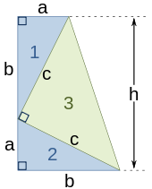

### 3、应用

(1)如果一个三角形是直角三角形，那么三边长必然满足勾股定理。

(2)如果一个三角形满足勾股定理，那么这个三角形必然是直角三角形。

## 三、投射的物体的高度

Height of a Projected Object.

$s=-16t^2 + v_0t + s_0$

### 1、匀变速直线运动

匀变速运动指的速度均匀变化的运动，即加速度恒定。
$$
1.速度时间公式：v_t = v_0 + at 
\\2.平均速度：\bar{v} = (v_0 + v_t) / 2 
\\3.位移公式：s=\bar{v} t=v_0t + \frac{1}{2}at^2
$$

### 2、重力加速度

9.8 m/s^2^

## 四、建模

Modeling with Quadratic Equations.

# 1.6、其它类型的方程及其应用

Other Types of Equations and Applications.

## 一、有理方程

Rational Equations.

解有理方程应该是利用最小公分母LCD去掉分母，而不是通分。

## 二、工作效率问题

Work Rate Problems.

## 三、含根式方程

Equations with Rational Exponents.

## 四、含有理指数方程

Equations with Rational Exponents.

## 五、二次方程的形式

Equations Quadratic in Form.

# 1.7、不等式

## 一、线性不等式

### 1、不等式

用不等号连接的表达式称为不等式。其中，使用<、>连接的称为严格不等式(strict inequalities)，其它的称为非严格不等式(nonstrict inequalities)。

### 2、不等式性质

设a、b、c是实数。

(1)加法单调性

如果a<b, 那么a + c < b+c

(2)乘法单调性

如果a<b, c>0, 那么ac < bc;如果a<b, c<0, 那么ac > bc;

### 3、线性不等式

形如$ax + b > 0(a,b \in R且a \neq 0)$的不等式称为线性不等式(Linear Inequalities.)，即不等式中的未知数最高次数是1.

### 4、区间符号

不等式的解可以使用区间符号(interval notation)表示。开区间(open interval)用小括号(parenthesis)表示，闭区间(closed interval)用中括号[square bracket]表示。

### 5、盈亏平衡点

全部销售收入(Revenue)等于全部成本(Cost)时的产量称为盈亏平衡点(Break Even Point,简称BEP)。此时R=C。

## 二、含三项的不等式

形如-2 < 5 + 3x < 20的不等式称为Three-Part Inequalities。

## 三、二次不等式

形如ax^2^ + bx + c <0的不等式称为二次不等式(Quadratic Inequalities)，即不等式中的未知数的最高次数是2。解二次不等式的时候，通过代入区间的值判断区间满足要求。

### 1、解代入法

先求出等于零的解，然后再将各个区间的解代入看哪个区间的解满足。

### 2、函数图像法

## 四、有理不等式

形如$\frac{5}{x+4} \ge 1 $，包含一个或者多个有理式的不等式称为有理不等式(Rational Inequalities)。如果分母不能确定正负情况，那么就不能约去分母。

### 1、解不等式组

### 2、解代入法

注：

(1)解不等式的定义域范围为实数。

## 五、三次不等式

### 1、 x ^3^ + 4x ^2^ - 9x $\ge$36 怎么化简？

(1)一个一个代入计算看是否等于0。

(2)取得等于零的值后，使用长除法二次式。

### 2、序轴标根法

也叫“穿针引线法”。通过此法可以判断一元高次不等式的解。而不用一个一个判断。

# 1.8、绝对值方程与绝对值不等式

Absolute Equations and Inequalities.

## 一、基础概念

Basic Concepts.

### 1、绝对值

绝对值表示一个数在数轴上对应的点到原点的距离(undirected distance，无向性)。绝对值用符号||表示，如a的绝对值为|a|。

因为表示的是距离，所以$|a| \ge 0$。

## 二、绝对值方程

### 1、定义

含有绝对值的方程称为绝对值方程(Absolute Value Equations)。

### 2、求解

如果|a| = |b|，那么有a = b或者a = -b。

## 三、绝对值不等式

Absolute Value Inequalities.

## 四、特例

Special Cases.

设k<0。

(1)当|a|> k, 解集为R。
(2)当$|a|\le k$, 无解。

## 五、距离和公差的绝对值模型

Absolute Value Models for Distance and Tolerance.

### 1、|a-b|

|a-b|表示a到b的距离。

### 2、公差

### 六、问题

### 1、within

使用within时，不包含endpoint。

### 2、range

# 2.1、直角坐标系及其绘制

Rectangular Coordinates and Graphs.

## 一、有序对

由两个元素(component)a、b按一定的顺序排列成的二元组叫做有序对(Ordered Pairs)，记作(a, b)。其中a称为第一个元素，b称为第二个元素。

## 二、直角坐标系

The Rectangular Coordinate System.

水平数轴和垂直数轴交叉组成的坐标平面(coordinate plane)称为直角坐标系。它们的交点称为原点(origin)，水平轴称为x轴(x-axis)，垂直轴称为y轴。也叫笛卡尔(Cartesian)坐标系。

直角坐标系被x轴、y轴划分为四个象限，但是坐标轴上的点不属于任何一个象限。坐标系里面的点P可以用有序对(a, b)表示，a,b称为P点的坐标(coordinate)。

## 三、距离公式

Distance Formula.

### 1、定义

设xoy平面上有两点P(x~1~，y~1~)和R(x~2~，y~2~)(因为勾股定理用到第二点Q，所以该点命名为R)，利用勾股定理可求PR的距离为：

$d(P, R) = \sqrt{(x_1-x_2)^2+(y_1 - y_2)^2}$

### 2、判断三点否是共线

(1)距离公式，两个小距离加起来等于一个大距离。

(2)斜率。

### 3、判断三角形是否是直角三角形

非组成斜边的点为三角形的直角点。

## 四、中点坐标公式

### 1、公式

设一条线段(line segment)的两个端点(endpoint)为P(x~1~，y~1~)和Q(x~2~，y~2~)。则它们的中点(midpoint)M的坐标为：

$M=(\frac{x_1+x_2}{2},\frac{y_1 + y_2}{2})$

### 2、推导

(1) 全等三角形(ASA)

(2)向量

## 	五、二元一次方程

Equations in Two Variables.

有序对可以用来表示二元一次方程的解，通常x的值写在前面，y的值写在后面。

### 1、截距

截距式图形与x轴或者y轴的交点。

注：在我国的定义中，截距是x坐标或者y坐标的其中一个，不是截点。

## 六、平面图形

### 1、菱形

四边都相等的四边形称为菱形(rhombus)，菱形是邻边相等的平行四边形。这种定义下，正方形是特殊的菱形。

菱形的证明

1. 一组邻边相等的平行四边形是菱形；
2. 对角线互相垂直的平行四边形是菱形；
3. 四条边均相等的四边形是菱形；
4. 对角线互相垂直平分的四边形；
5. 两条对角线分别平分每组对角的四边形；
6. 有一对角线平分一个内角的平行四边形；

### 2、平行四边形

两组对边分别平行的四边形称为平行四边形(parallelogram)。

(1)平行四边形的证明

1. 两组对边分别相等的平面四边形是平行四边形；
2. 两组对角分别相等的平面四边形是平行四边形；
3. 两组邻角分别互补的四边形是平行四边形；
4. 一组对边平行且相等的四边形是平行四边形；
5. 两组对边分别平行的四边形是平行四边形；
6. 对角线相交且互相平分的四边形是平行四边形。

## 七、问题

### 1、距离坐标公式推导

### 2、47-58绘图问题

如果不知道函数图像，那么根据点来画坐标可能只得到部分图像。

# 2.2、圆

## 一、圆的标准方程

Center-Radius Form.

### 1、定义

在同一平面内，到定点等于定长的所有点的集合称为圆(circle)。其中,定点称为圆心(center)，定长称为半径(radius)。

### 2、标准方程

设圆心坐标为O(a,b)，圆上任意一个点的坐标为(x, y)，半径为r,根据**距离公式**有：

(x-a)^2^ + (y - b)^2^ = r^2^

该方程称为圆的标准方程(center-radius form)。当a, b等于0时，圆的标准方程式一个二次方程：

$x^2 + y^2 = r^2$

## 二、圆的一般方程

### 1、一般方程

讲圆的标准方程展开，并且使右边等于0，那么即可得到圆的一般方程：$x^2 + y2 + Dx + Ey + F = 0(D、E、F\in R)$。

### 2、标准方程和一般方程的转换

利用**完全平方公式**可以将一般方程转为标准方程:$(x+\frac{D}{2})^2 + (y+ \frac{E}{2})^2 = (\frac{\sqrt{D^2+E^2-4F}}{2})^2$

(1)那么圆心O坐标为：$O(-\frac{D}{2}, -\frac{E}{2})$

(2)半径：$r=\frac{\sqrt{D^2+E^2-4F}}{2}$

(3)

当$D^2+E^2-4F>0$, 此时是一个圆；

当$D^2+E^2-4F=0$，此时是一个点；

当$D^2+E^2-4F<0$，图形不存在；

## 三、应用

An Application.

## 问题

### 使用程序绘制圆

参考资料3。

### 怎么求两个圆的交点

(1)联立方程组

(2)绘图

# 2.3、函数

## 一、关系与函数

### 1、自变量&因变量

一般来说，如果变量y的值取决于变量x的值，那么y称为因变量(dependent variable)，x称为自变量(independent variable)。

### 2、关系&函数

对于任意的自变量，都有唯一的因变量与之对应，那么这样的关系称为函数。

## 二、定义域与值域

### 1、定义域

由所有自变量组成的集合称为定义域(domain)。一般地，如果没有特殊说明，函数定义域在实数范围内讨论。

### 2、值域

由所有的因变量组成的集合称为值域(range)。

## 三、判断关系是否是函数

### 1、垂线测试

垂线测试(vertical line test)用于判定一个关系是否为函数：一条垂直线与函数图像至多有一个交点。

## 四、函数符号

y=f(x)，f(x)称为函数符号，读作“f of x”或者"f at x"。

## 五、递增、递减和常数函数

设I为**开区间**，且x~1~, x~2~属于I。

### 1、递增

如果对于任意的x~1~< x~2~，都有f(x~1~) < f(x~2~)，那么我们就说f在区间I上递增(increasing)。

### 2、递减

如果对于任意的x~1~< x~2~，都有f(x~1~) ？ f(x~2~)，那么我们就说f在区间I上递减(decreasing)。

### 3、恒等

如果对于任意的x~1~< x~2~，都有f(x~1~) = f(x~2~)，那么我们就说f在区间I上恒等(constant)。

## 问题

### 1、有争议题目

(1)第6题。

(2)第28题 vs 第31题。

(3)第34题三次函数值域问题。

(4)第47题，反比例值域问题。

### 2、函数单调性为什么假设为开区间？

# 2.4、线性函数

## 一、基本概念

### 1、线性函数

设a,b是实数，则函数f(x) = ax+b称为线性函数(linear function)。因为这些函数的图像在直角坐标系中是直线，即线性的，所以称为线性函数。

### 2、常数函数

如果a=0,则函数f(x) = b称为常数函数。

## 二、线性方程的标准形式

### 1、Ax + By = C

方程Ax + By = C称为线性方程的标准形式(也叫一般式)。

## 三、斜率

### 1、斜率

斜率(slope)是直线倾斜程度的**度量**。在几何中，斜率等于垂直方向上的变化量(rise)与上水平方向上的变化量(run)。
$$
m = \frac{rise}{run}=\frac{\Delta y}{\Delta x} = \frac{y_2 - y_1}{x_2 - x_1}
$$
注：

(1)垂直线的斜率不存在(undefined)。

(2)水平线的斜率为0。

### 2、y=ax+b

如果直线的方程可以写作y=ax+b，那么直线的斜率为m=a（使用直线上的两点坐标进行证明）。

## 四、平均变化率

### 1、定义

设f(x)是定义在区间[a, b]上的线性函数，则f(x)在[a, b]上的平均变化率(average rate of change)为：$\frac{f(b)-f(a)}{b-a}$

## 五、线性模型

### 1、固定成本(fixed cost)

# 2.5、线性方程和线性模型

Equations of Lines and Models

## 一、点斜式

### 1、定义

已知直线上一点(x~1~,y~1~)，并且存在直线的斜率m，直线可用方程   $y-y_1 = m(x-x_1)$     表示。该方程称为直线的点斜式(Point-Slope Form)。

### 2、推导

斜率的定义。

## 二、斜截式

### 1、定义

设直线在y轴上的截距为b，并且存在直线的斜率m，(由点斜式转换)则直线可用方程  $y=mx + b$   表示，该方程称为直线的斜截式(Slope-Intercept Form)。

### 2、推导

点斜式变形。

### 3、斜截式与标准式的关系

设直线的方程为$Ax+By=C$,则有：
$$
\begin{align*}
斜率：m=\frac{A}{-B}\\
截距：(0,\frac{C}{B})
\end{align*}
$$


## 三、垂直和水平线

Vertical and Horizontal Lines

### 1、垂直线方程

如果一条垂直线过点(a, b)，那么这条垂直线的方程为x=a。

### 2、水平线方程

如果一条水平线过点(a, b)，那么这条水平线的方程为y=b。

## 四、平行线和垂直线

Parallel and Perpendicular Lines

### 1、逻辑语句

if and only if=if p then q and if q then p.翻译为当且仅当。

### 2、平行线

国内定义(是否相交)：在平面内，永不相交的两条直线叫做平行线(parallel lines)。

教材定义(斜率角度)：两条不同的非垂直线是互相平行的，当且仅当它们有相同的斜率。其中，一条直线叫做另一条直线的平行线。

### 3、垂直线

国内教材定义(夹角)：在平面内，如果两条线的夹角是90度，那么这两条线是垂直线。

教材定义(斜率角度)：两条不垂直于x轴的线是互相垂直的，当且仅当它们斜率的乘积是-1。其中，它们的交点叫做垂足，一条直线叫做另一条直线的垂直线。

## 五、建模数据

Modeling data

### 1、散点图

在回归分析中，数据点在直角坐标系平面上分布的图称为散点图(scatter proram)。

### 2、建模步骤

(1)绘出散点图。

(2)找出方程。

### 3、线性回归

线性回归是指利用统计学中的回归分析，来确定变量之间的关系的一种统计分析方法。

## 六、一元线性方程的图解

Graphical Solution of Linear Equation in One Variable

## 七、直线方程(补充)

### 1、两点式


# 2.6、基本函数的图像

## 一、连续性

Continuity.

### 1、领域

$$
设 \delta(英: [ˈdeltə]，中：德塔)是一个整数，则开区间(a-\delta, a+\delta)称为点a的邻域。\\
记作U(a) = {x| a-\delta<x<a+\delta}, 点a称为这个邻域的中心，\delta称为这个邻域的半径。
$$

### 2、点的连续性


## 二、恒等、平方和立方函数

The Identity, Squaring, and Cubing Functions.

## 三、平方根和立方根函数

The Square Root and Cube Root Functions.

## 四、绝对值函数

The Absolute Value Function.

## 五、分段函数

Piecewise-Defined Functions.

## 六、x = y^2^

The Relation x = y^2^。

# 2.7、绘图技术

Graph Techniques.

## 一、伸缩

### 1、垂直方向伸缩

设a>0，并且点(x, y)位于函数y=f(x)的图像上。那么点(x, ay)位于函数y=af(x)的图像上。

(1)如果0<a<1，那么函数y=af(x)的图像是函数y=f(x)的图像在垂直方向上的缩小(shrinking)（即，对于同一x，y的值变大）。

(2)如果a>1，那么函数y=af(x)的图像是函数y=f(x)的图像在垂直方向上的伸长(stretching)（即，对于同一x，y的值变小）。

### 2、水平方向伸缩

设a>0，并且点(x, y)位于函数y=f(x)的图像上。那么点$(\frac{x}{a}, y)$位于函数y=f(ax)的图像上。

(1)如果0<a<1，那么函数y=f(ax)的图像是函数y=f(x)的图像在水平方向上的伸长(stretching)（即，为了获得相同的y值，x值变大）。

(2)如果a>1，那么函数y=f(ax)的图像是函数y=f(x)的图像在水平方向上的缩小(shrinking)（即，为了获得相同的y值，x值变小）。

## 二、反射

### 1、反射

把一个物体转换为它的镜像，这样的行为反射(reflecting)。

### 2、函数在x轴上的反射

设函数y=f(x)，则函数在x轴上反射形成的函数为y=-f(x)。

### 3、函数在y轴上的反射

设函数y=f(x)，则函数在y轴上反射形成的函数为y=f(-x)。

## 三、对称

### 1、y轴对称

如果方程关于y轴对称，那么f(-x)=f(x)。

注：

(1)这条也适用于函数。

(2)判断方程是否关于x轴对称，那么只需令x=-x，然后判断新方程与原方程是否相等即可。

### 2、x轴对称

如果方程关于x轴对称。则f(x)=-f(x)。一般表现为x=y^2^+c的形式。

注：

(1判断方程是否关于y轴对称，那么只需要令y=-y，然后判断新方程与原方程是否相等即可。

### 3、原点对称

如果点(x, y)关于原点对称，那么对称的点的坐标为(-x, -y)。

注：

(1判断方程是否关于原点对称，那么只需要令x=-x，y=-y，然后判断新方程与原方程是否相等即可。

## 四、奇偶函数

### 1、偶函数

在定义域内，对于任意的x，有f(x)=f(-x)，则函数f(x)称为偶函数。偶函数关于y轴对称。

### 2、奇函数

在定义域内，对于任意的x，有f(-x)=-f(x)，则函数f(x)称为奇函数。奇函数关于原点对称。

注：

(1)函数的奇偶性描述的是函数的对称性。

## 五、移动

### 1、竖直方向上移动

设$g(x)=f(x)+c(c \in R)$。

(1)对于函数f上任意的点(x, y)，对应着函数g上的点(x, y+c)。

(2)函数g的对象和函数f的图像一致。当c>0，函数图像上移c个单位；当c<0，函数图像下移c个单位。

### 2、水平方向上移动

设$g(x)=f(x-c)(c \in R)$。

(1)对于函数f上任意的点(x, y)，对应着函数g上的点(x+c, y)（x值变化，y值不变）。

(2)函数g的对象和函数f的图像一致。当c>0，函数图像右移c个单位；当c<0，函数图像左移c个单位。

### 3、总结

总结宜用表格展示，更直观。

| c>0      | y=f(x)移动c个的单位 |
| -------- | ------------------- |
| y=f(x)+c | 上移                |
| y=f(x)-c | 下移                |
| y=f(x+c) | 左移                |
| y=f(x-c) | 右移                |

### 4、伸缩和移动的区别

函数图像伸缩时，图像大小发生变化，乘除法运算；而图像移动时，大小和原来保持一致，加减法运算。

## 问题

### 1、反射和对称的区别？

反射是对称的一种特殊形式。

# 2.8、函数运算与复合

## 一、函数的算术运算

### 1、四则运算

(1)sum function:  $(f+g)(x) = f(x)+g(x)$

(2)difference function: $ (f-g)(x) = f(x)-g(x)$

(3)production function:  $(f*g)(x) = f(x)*g(x)$

(4)quotient function:  $(\frac{f}{g})(x)=\frac{f(x)}{g(x)}(g(x)\neq0)$

## 二、差商

### 1、差商

点P(x, f(x))位于函数y=f(x)上，h是一个正数，点Q(x+h, f(x+h))也位于函数上，则PQ所在直线的斜率为：

$\frac{f(x+h)-f(x)}{h}$

该表达式称为差商（或均差，the difference quotient）。直线PQ称为割线(secant line)。

注：

(1)当h无限小时，直线PQ的斜率接近于P点切线的斜率。

### 2、差商和斜率的区别


## 三、函数及其定义域的复合

### 1、复合函数

设f，g是两个函数，则它们的复合函数可以写作：

$(f \circ g)(x)=f(g(x))$

### 2、复合函数的定义域

设f(u)的定义域是B，u=g(x)的定义域是A，则复合函数y=f(g(x))的定义域为$\{ x|x\in A且g(x)\in B \}$

### 3、复合函数的应用

销售时的“折上折”。

## 问题

### 1、第25题数据可能存在误差

https://nces.ed.gov/programs/digest/d19/tables/dt19_318.45.asp

# chapter2 Review

## 一、第4题

看到三个点的坐标应该在脑子里形成这三个点的形状。

## 二、第6题

对于大的数开根号时，还是要尝试化简（1-10平方内）。

# 3.1、二次函数与模型

## 一、多项式函数

### 1、多项式函数

形如$f(x)=a_nx^n + a_{n-1}x^{n-1}+...+a_1x + a_0(a_n\neq 0)$的函数称为多项式函数(Polynomial Functions)。其中，n为整数，a~n~...a~0~为复数，a~n~称为首项系数(leading term)。

### 2、零多项式

f(x)=0,称为零多项式(zero polynomial)。

## 二、二次函数

### 1、二次函数

形如$f(x)=ax^2+bx+c(a, b, c为复数且a\neq 0)$ 的函数称为二次函数(Quadratic Functions)。

最简单的二次函数:f(x)=x^2^ 。

### 2、抛物线

二次函数的图像称为抛物线(parabola)。图像的对称轴(axis of symmetry)与图像的交点称为抛物线的顶点(vertex)。

## 三、画图技巧

任何二次函数图像都可以看作是经过函数f(x)=x^2^的图像变化而得。

### 1、a的正负情况决定开口方向

(1)a>0, 开口向上(opens up)。

(2)a<0, 开口向下(opens down)。

### 2、a的大小决定垂直伸缩(开口大小)

(1)|a|>1,垂直方向上伸长(vertically stretched)，变得更窄(narrower)。

(2)0<|a|<1,垂直方向上缩短(vertically shrunk)，变得更宽(wider)。

### 3、h的正负决定水平方向上移动

(1)h>0, 向右移动(shift right h units)。

(2)h<0, 向左移动(shift left  |h| units)。

### 4、k的正负决定垂直方向上移动

(1)k>0, 向上移动(shift up h units)。

(2)k<0, 向下移动(shift down  |h| units)。

## 四、完全平方

### 1、标准式 转顶点式

二次函数标准式f(x)=ax^2^+bx+c根据**完全平方公式(Completing the Square)**，可以化作顶点式$f=a(x-h)^2+k$。这里要掌握推导。

## 五、顶点公式

### 1、顶点公式

二次函数的顶点坐标公式(The Vertex Formula)为：$(-\frac{b}{2a}, \frac{4ac-b^2}{4a})$。

### 2、对称轴

$x=-\frac{b}{2a}$为抛物线的对称轴。

## 六、二次函数模型

现实生活中，许多事物可以用二次函数建模（Quadratic Models）。

### 1、物体上升高度(重力加速度)

s(t)=v~0~t - 16t^2^

## 问题

### 1、example 6(p337) 

怎么就得到是二次函数？如果是自己怎么建模？

### 2、第64题

角度的作用。

# 3.2、综合除法

## 一、综合除法

### 1、多项式除法

设f(x)、g(x)是两个多项式，且g(x)的次数比f(x)的次数低，则存在多项式q(x)和r(x)使得：

$f(x)=g(x)*q(x)+r(x)$。

其中，r(x)的次数比g(x)次数低。

示例：

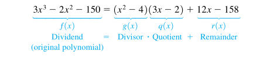

注：

(1)一个高次多项式可由若干个低次多项式相乘、相加得到。

### 2、综合除法

当除数为一次二项式(x-k)时，多项式的除法称为综合除法(synthetic division)。

设f(x)是多项式，k是复数，则存在唯一的多项式q(x)和数(number)r使得：

f(x)=(x-k)q(x)+r

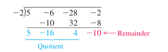

注：

(1)作为优化，一次二项式总是写成x-k的形式，然后运算的时候使用加法。

### 3、应用

(1)因式分解。

## 二、余式定理

### 1、定义

余式定理(remainder theorem)是指一个多项式f(x)除以一个线性多项式(x-k)(k是复数)的余数是f(k)。即：

如果f(x)=(x-k)q(x)+r，则f(k) = r。

注：

(1)当K值很大时或者为复数时，应该使用综合除法进行计算。

### 2、证明

根据除法的定义及性质。

### 3、推广

余数定理可以推广到多项式除以多项式。

## 三、多项式的函数的潜在零点

### 1、零点

对于多项式函数y=f(x)，使得f(x)=0的实数x叫做该函数的零点。零点也叫做函数的根(root)或者解(solution)。

### 2、求解

(1)可以使用余数定理验证一个数是否是零点。

(2)使用综合除法求解零点。

## 问题

### 物体里面的左右问题

和文字一样从左到右。

### 多项式讲解的顺序问题

应该先讲解综合除法，再推广到多项式除以多项式。

### number到底指什么数？

## 总结3.2

1、对不同的题型要自己做一遍，可减少相同的题型。

2、综合除法没有的项要补零，切记。

# 3.3、多项式函数的零点

## 一、因式定理

### 1、定义

因式定理(factor theorem)规定： 多项式f(x)含有因式(x-k)当且仅当f(k)=0。因式定理描述的是一个多项式的因式与零点的关系的定理，是余式定理的特殊情况。

$f(x)=(x-k)q(x) \iff f(k)=0$

### 2、应用

(1)判断x-k是否是某个多项式的因式——优先考虑综合除法与余式定理。

### 3、推广

因式(x-a)可以推广到任意的线性因式ax-b。即：$“ax-b为f(x)的因式 \iff f(\frac{a}{b})=0$

## 二、有理根定理

### 1、定义

有理根定理(rational root theorem)规定：设多项式 $f(x)=a_{n}x^{n}+a_{n-1}x^{n-1}+\cdots +a_{0}(a_{i}\in \mathbb {Z},and a_{0},a_{n} \neq 0)$，如果最低项(p、q互质或者说p、q的最大公约数是1)$x=\frac{p}{q} $  是f(x)的零点，则p、q满足：

(1)p是常数项a~0~的(整数)因子，且

(2)q是首项系数a~n~（整数）因子。

注：

(1)也称为“有理零定理（rational zero theorem）”

(2)有理根定理描述了整数系数方程的有理根与整数系数的约束。

(3)因数的定义域为整数。

(4)有理根定理只是告诉我们可能的根，并不是实际的根。

### 2、证明(proof)

(1)第一证明

(2)高斯引理

## 三、零点个数

### 1、代数基本定理

任何复系数的一元n次($n\ge 1$)多项式至少有一个复数根。

f(x)=(x-k~1~)q(x), f(k~1~)=0

证明：

### 2、代数基本定理推论

n次复系数多项式最多有n个不同的根。

证明：代数基本定理。

## 四、共轭根定理

### 1、共轭复数的性质

property of conjugate

设c、d是复数。

(1)和(差、积、商)的共轭等于共轭的和(差、积、商)

$\overline{z+w}=\overline{z}+\overline{w}$

(2)幂的共轭等于共轭的幂

$\overline{z^{n}}=(\overline{z})^{n}$

注：

(1)证明:利用共轭复数的定义可证明。设$z=a+bi, \overline{z}=c+di$

### 2、共轭根定理

conjugate zeros theorem

设f(x)是**实系数**函数，如果复数$z=a+bi(a、b是实数)$是f(x)的零点，则z的共轭复数$\overline{z}=a-bi$也是f(x)的零点。

$f(a+bi)=0\iff f(a-bi)=0$

注：

(1)证明：利用共轭复数的性质可证明。

## 五、多项式函数的零点

### 1、奇偶性与根的关系

次数为奇次的多项式最少有一个实数根，次数为偶次的多项式可能没有实数根。

## 六、笛卡尔符号法则

### 1、定义

如果把一元实系数多项式按降幂方式排列，则有：

(1)正实数根的个数等于“相邻项符号的变化次数”，或者比“变化次数”小一个正偶数。

(2)负实数根的个数等于“所有奇次项变号后，所得到的多项式的相邻项符号的变化次数”，或者比“变化次数”小一个正偶数。

注：

(1)笛卡尔符号法则用于判断正根与负根的个数。

(2)奇次项指次数为奇次的项，不是顺序为奇次。

(3)除了正根，负根，剩下的是复数根。

## 问题

### 1、example 3(b)

怎么知道哪个数是零点？

### 2、p364, 第95题

大家是怎么找出这个根的。

## 总结

### 1、有理根定理的运用

运用“有理根定理”求根的时候首先尝试$\pm{1}, \pm{2}, \pm{3}$。

# 3.4、多项式函数:图像、应用、建模

## 一、f(x)=x^n^的图像

### 1、n=3,5,...

(1)定义域，值域。

(2)奇函数,关于原点对称，形如n=3。

### 2、n=2,4,...

(1)定义域，值域。

(2)偶函数,关于原点对称，形如n=2。

## 二、f(x)=a(x-h)^n^+k的图像

看成是经过f(x)=x^2^变化而来。

## 三、根穿过x轴的情况

设c为f(x)的零点，则(c,0)为f(x)x轴截距。

### 1、zero of multiplicity 1

与x轴相交。

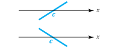

### 2、zero of multiplicity even

与x轴相切，但是不穿过x轴。

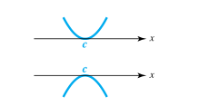

### 3、zero of multiplicity odd

与x轴相切且穿过x轴。

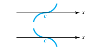

## 四、拐点和末端走势

### 1、拐点(turning point)

(1)定义

使函数图像由递增变为递减的点称为拐点(turning point)，反之亦然。

(2)个数

n次多项式函数最多有n-1个拐点；每对连续的根之间至少有一个拐点。

证明：

### 2、末端走势(end behavior)

末端走势由多项式的最大项(dominating term)系数决定。

(1)奇函数

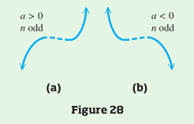

(2)偶函数

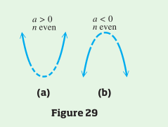

## 五、绘图

### 1、步骤

(1)找出所有的实数根，画出x截距。

(2)找出f(0)=a~0~，画出y截距。

(3)找出图像的末端走势等，画出图像。

## 六、中间值定理&有界性定理

### 1、中间值定理

也称为介值定理。设f(x)实系数多项式函数，对于任意的实数a, b以及它们的函数值f(a), f(b)，如果f(a)与f(b)符号相反，则a、b之间**至少**存在一个实数根。

证明：暂缓。

### 2、有界性定理

设f(x)是一元n($n\ge 1$)次实系数多项式，且首项系数为正。假设f(x)综合除以(x-c):

(1)如果c>0且综合除法的底行所有数字是非负的，那么c是最大的零点。

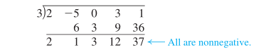

(2)如果c<0且综合除法的底行所有数字的符号是交替变化的，那么c是最小的零点。

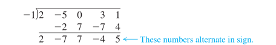

证明：使用“综合除法”的定义可证明。

## 七、估算实数根

### 1、使用绘图工具

## 八、多项式建模

### 1、

## 问题

### 1、拐点个数怎么证明？(p368)

### 2、end behavior怎么翻译？

### 3、P370图像

左边的图像怎么怎么知道两点之间只有一个拐点？

## 总结

### 1、球的体积

球的体积计算公式：$\frac{4\pi r^3}{3}$

# 3.5、有理函数:图像,应用,建模

## 一、反比例函数:$f(x)=\frac{1}{x}$

### 1、有理函数

形如$f(x)=\frac{p(x)}{q(x)}$的函数称为有理函数(rational function)。其中，p(x),q(x)为多项式，且q(x)不等于零。示例：

$f(x)=\frac{x+1}{2x^{2}+5x-3}$

注：

(1)因为定义域不能等于零，所以从整个图像来说，它们是不连续的。

### 2、反比例函数

(1)定义

函数$f(x)=\frac{1}{x}(x\neq 0)$称为反比例函数(reciprocal function)。反函数是最简单的有理函数。

(2)定义域&值域

定义域：$(-\infty, 0) \cup (0, \infty) $

值域：$(-\infty, 0) \cup (0, \infty) $

(3)图像

(4)单调性

(5)连续性

(6)奇偶性

(7)渐近线

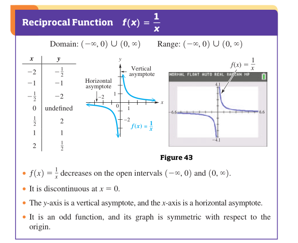

## 二、$f(x)=\frac{1}{x^{2}}$

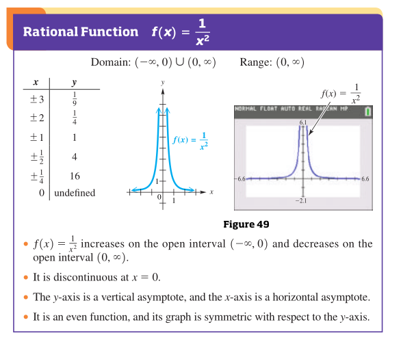

## 三、渐近线

## 四、画图

## 五、建模

# 附录一：单位换算

一、英里(mile)

缩写：mi。

1 mile = 1.60934 km(公里) = 1609.34 m（米）

二、码(yard)

缩写：yd。

1yard = 3 feet(3取的是正数) = 0.9144米

三、英尺(foot/feet)

缩写：ft。

1m = 3.3 feet

1feet = 0.3meter

四、英寸(inch)

缩写：in。

1feet = 12 inch

1inch = 2.54centimeter

五、盎司(ounce)

缩写:oz

1 ounce = 28 grams（克）

1 gram = 0.035 ounce

六、兆(megabit)

1 megabit = million bits

# 附录二：公式

1、欧姆定律(Ohm's Law)

$I={\frac{V}{R}}$

```
I: Intensity of current,电流强度(简称电流)
E:Voltage,电压
R:Resistance/Impedance,电阻
```

2、矩形体积

$V = lwh$

```
V: volume,体积
l:length,长
w:width,宽
h:height,高
```

# 附录三：参考资料

[1]List of Latex mathematical symbol: https://oeis.org/wiki/List_of_LaTeX_mathematical_symbols#Set_and.2For_logic_notation

[2]lsu, College Algebra and Trigonometry: https://www.math.lsu.edu/dept/courses/videos

[3]绘图工具：

https://www.desmos.com/calculator


# 附录四：注意点

1、公式的证明。例如：勾股定理。

# 附录五：易混淆单词

1、lot & land


